# Architecture and feature flows

How the app is built and how each feature moves through it. Each diagram is an image (click it for the SVG, which can be zoomed). The Mermaid source is under it, in a collapsed part.

- **This file** is written by hand: the layers, the data model and the flows.
- [component-tree.md](./component-tree.md) is **generated** from the real imports: for every page, the hierarchy of components, hooks, client service, API route and server services.
- [file-usage.md](./file-usage.md) is **generated**: for every file, what it uses and who uses it.

Regenerate the last two after the code changes: `npx tsx scripts/generate-architecture.ts`, then `npx tsx scripts/render-diagrams.ts` to draw the images.

## The app flow: screens and navigation

What the teacher can do and where each action leads. Boxes are pages, rounded boxes are dialogs or modals. A two-way arrow is a round trip (go there, finish, come back).

### Overview

Mermaid source

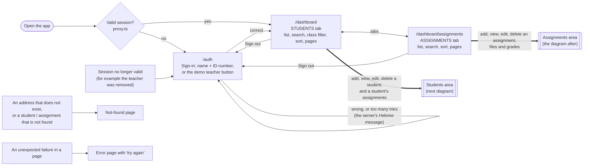
```mermaid
flowchart LR
  open(["Open the app"]) --> proxy{"Valid session?<br>proxy.ts"}
  proxy -- "no" --> auth["/auth<br>Sign-in: name + ID number,<br>or the demo teacher button"]
  proxy -- "yes" --> students
  auth -- "correct" --> students
  auth -- "wrong, or too many tries<br>(the server's Hebrew message)" --> auth

  students["/dashboard<br>STUDENTS tab<br>list, search, class filter, sort, pages"]
  assignments["/dashboard/assignments<br>ASSIGNMENTS tab<br>list, search, sort, pages"]
  students <-->|"tabs"| assignments

  students ==>|"add, view, edit, delete a student,<br>and a student's assignments"| studentsArea[["Students area<br>(next diagram)"]]
  assignments ==>|"add, view, edit, delete an assignment,<br>files and grades"| assignmentsArea[["Assignments area<br>(the diagram after)"]]

  students -- "Sign out" --> auth
  assignments -- "Sign out" --> auth

  expired["Session no longer valid<br>(for example the teacher was removed)"] --> auth
  missing["An address that does not exist,<br>or a student / assignment that is not found"] --> notFound["Not-found page"]
  failure["An unexpected failure in a page"] --> errorPage["Error page with 'try again'"]
```

### Students area

[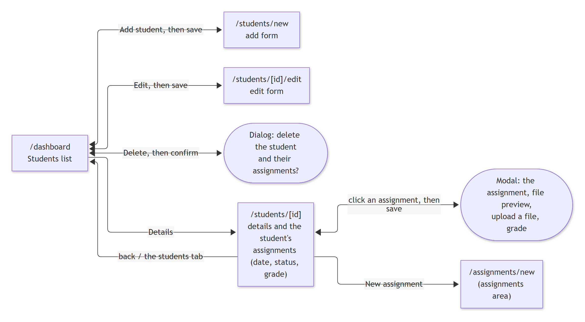](./diagrams/app-flow-students.svg)

Mermaid source

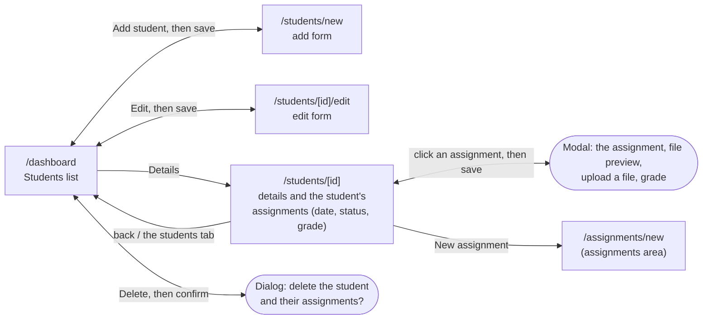
```mermaid
flowchart LR
  list["/dashboard<br>Students list"]
  new["/students/new<br>add form"]
  edit["/students/[id]/edit<br>edit form"]
  page["/students/[id]<br>details and the student's<br>assignments (date, status, grade)"]
  deleteDialog(["Dialog: delete the student<br>and their assignments?"])
  modal(["Modal: the assignment, file preview,<br>upload a file, grade"])
  newAssignment["/assignments/new<br>(assignments area)"]

  list <-->|"Add student, then save"| new
  list <-->|"Edit, then save"| edit
  list <-->|"Delete, then confirm"| deleteDialog
  list -->|"Details"| page
  page -->|"back / the students tab"| list
  page <-->|"click an assignment, then save"| modal
  page -->|"New assignment"| newAssignment
```

### Assignments area

[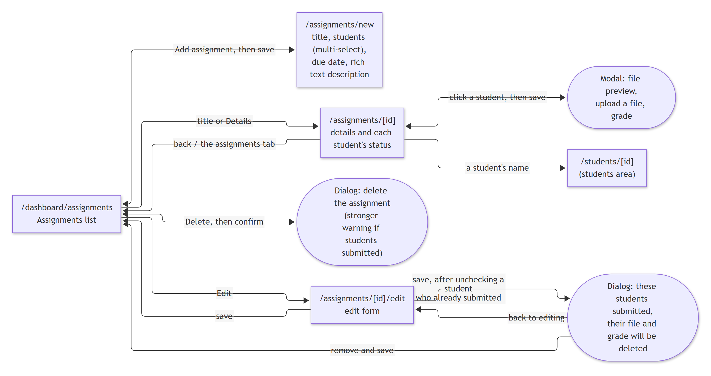](./diagrams/app-flow-assignments.svg)

Mermaid source

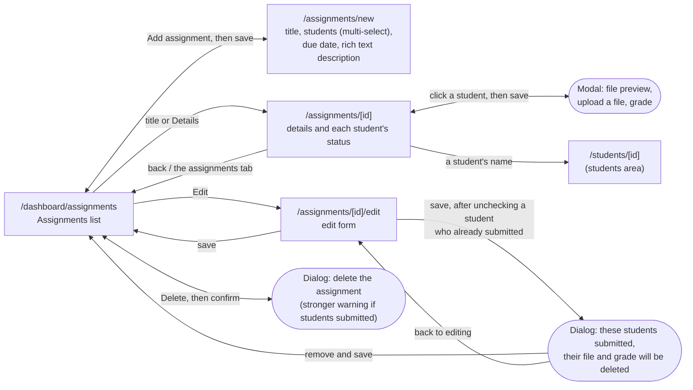
```mermaid
flowchart LR
  list["/dashboard/assignments<br>Assignments list"]
  new["/assignments/new<br>title, students (multi-select),<br>due date, rich text description"]
  edit["/assignments/[id]/edit<br>edit form"]
  page["/assignments/[id]<br>details and each student's status"]
  deleteDialog(["Dialog: delete the assignment<br>(stronger warning if students submitted)"])
  removal(["Dialog: these students submitted,<br>their file and grade will be deleted"])
  modal(["Modal: file preview,<br>upload a file, grade"])
  student["/students/[id]<br>(students area)"]

  list <-->|"Add assignment, then save"| new
  list -->|"title or Details"| page
  page -->|"back / the assignments tab"| list
  page <-->|"click a student, then save"| modal
  page -->|"a student's name"| student
  list <-->|"Delete, then confirm"| deleteDialog
  list -->|"Edit"| edit
  edit -->|"save"| list
  edit -->|"save, after unchecking a student<br>who already submitted"| removal
  removal -->|"remove and save"| list
  removal -->|"back to editing"| edit
```

## The layers

Mermaid source

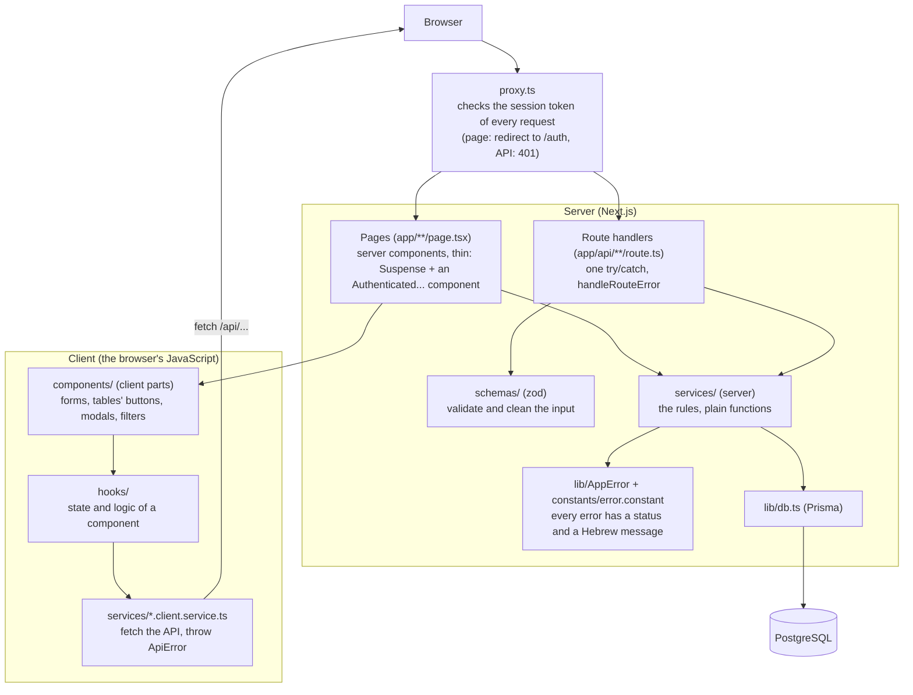
```mermaid
flowchart TB
  browser["Browser"]
  proxy["proxy.ts<br>checks the session token of every request<br>(page: redirect to /auth, API: 401)"]

  subgraph server["Server (Next.js)"]
    direction TB
    pages["Pages (app/**/page.tsx)<br>server components, thin: Suspense + an Authenticated... component"]
    routes["Route handlers (app/api/**/route.ts)<br>one try/catch, handleRouteError"]
    schemas["schemas/ (zod)<br>validate and clean the input"]
    services["services/ (server)<br>the rules, plain functions"]
    errors["lib/AppError + constants/error.constant<br>every error has a status and a Hebrew message"]
    prisma["lib/db.ts (Prisma)"]
  end

  subgraph client["Client (the browser's JavaScript)"]
    direction TB
    components["components/ (client parts)<br>forms, tables' buttons, modals, filters"]
    hooks["hooks/<br>state and logic of a component"]
    clientServices["services/*.client.service.ts<br>fetch the API, throw ApiError"]
  end

  db[("PostgreSQL")]

  browser --> proxy
  proxy --> pages
  proxy --> routes
  pages --> services
  pages --> components
  components --> hooks
  hooks --> clientServices
  clientServices -->|"fetch /api/..."| browser
  routes --> schemas
  routes --> services
  services --> errors
  services --> prisma
  prisma --> db
```

Rules the code follows:

- **A page reads data on the server** (`Authenticated...` component, under `<Suspense>`) and passes it down as props. The client never fetches data for a page.
- **A change goes through the API** (no server actions): a hook calls a client service, which calls a route handler, which validates with a schema and calls a server service.
- **The teacher id always comes from the session**, never from the request. Every query is scoped by it.
- **Every message the user sees is Hebrew and comes from the server** (`AppError`, or zod's Hebrew messages).

## Data model

Mermaid source

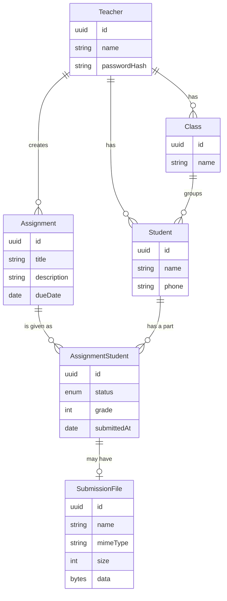
```mermaid
erDiagram
  Teacher ||--o{ "Class" : has
  Teacher ||--o{ Student : has
  Teacher ||--o{ Assignment : creates
  "Class" ||--o{ Student : groups
  Assignment ||--o{ AssignmentStudent : "is given as"
  Student ||--o{ AssignmentStudent : "has a part"
  AssignmentStudent ||--o| SubmissionFile : "may have"

  Teacher { uuid id string name string passwordHash }
  "Class" { uuid id string name }
  Student { uuid id string name string phone }
  Assignment { uuid id string title string description date dueDate }
  AssignmentStudent { uuid id enum status int grade date submittedAt }
  SubmissionFile { uuid id string name string mimeType int size bytes data }
```

### Status of a student's part

It is never chosen by hand: it follows from the file and the grade (the database also checks this).

[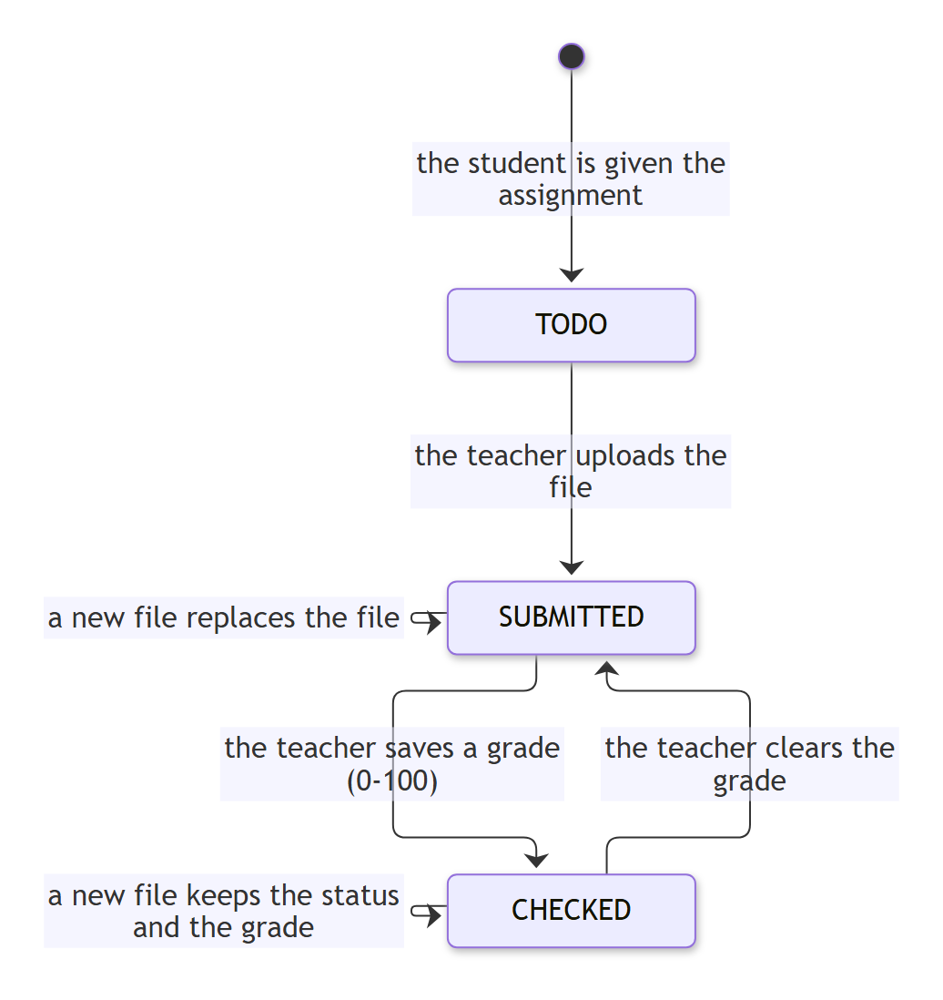](./diagrams/status.svg)

Mermaid source

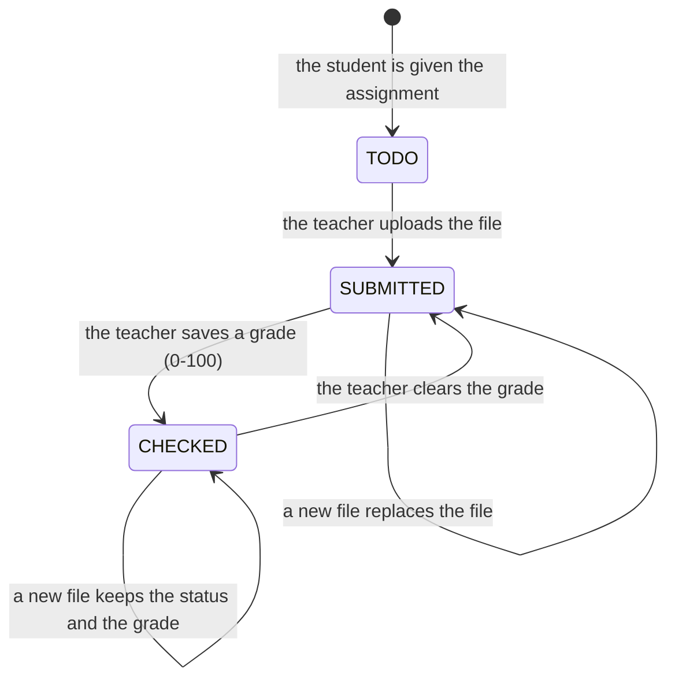
```mermaid
stateDiagram-v2
  [*] --> TODO: the student is given the assignment
  TODO --> SUBMITTED: the teacher uploads the file
  SUBMITTED --> CHECKED: the teacher saves a grade (0-100)
  CHECKED --> SUBMITTED: the teacher clears the grade
  CHECKED --> CHECKED: a new file keeps the status and the grade
  SUBMITTED --> SUBMITTED: a new file replaces the file
```

## Feature flows

### Sign-in, and the session on every request

[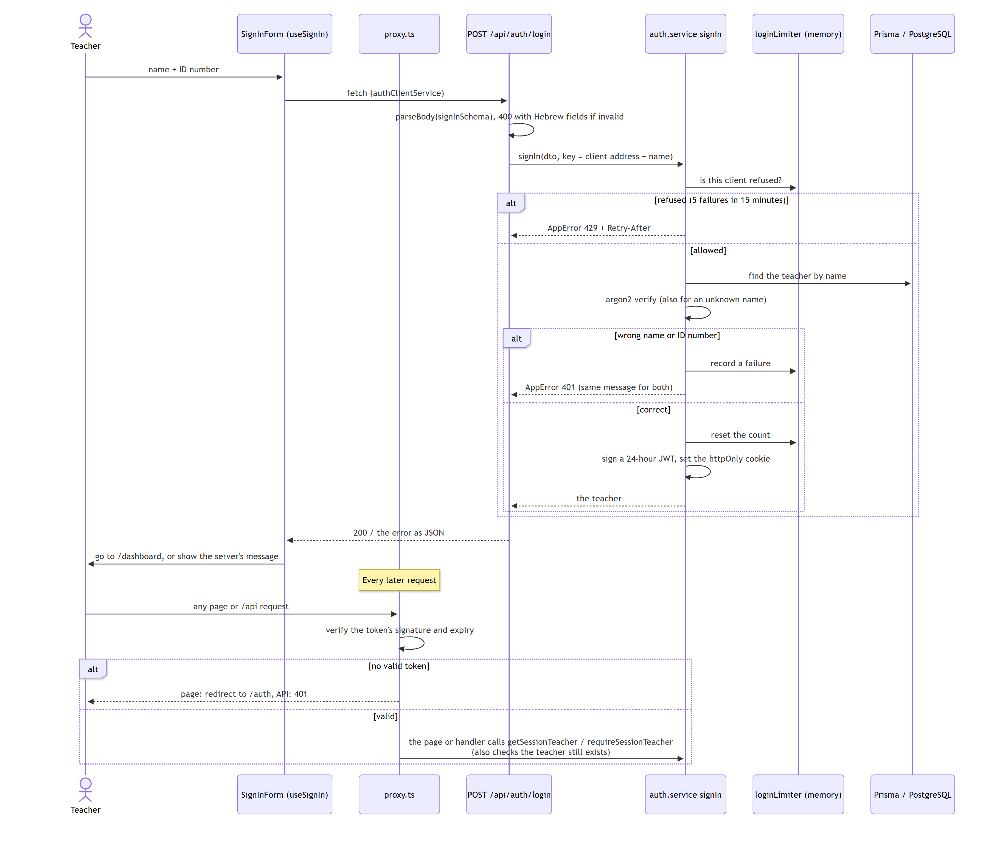](./diagrams/flow-signin.svg)

Mermaid source

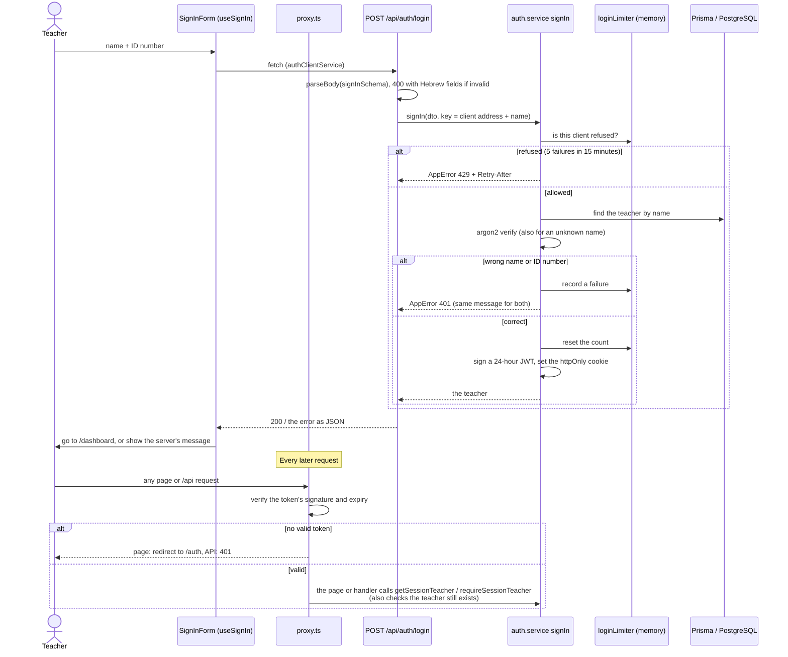
```mermaid
sequenceDiagram
  actor T as Teacher
  participant F as SignInForm (useSignIn)
  participant P as proxy.ts
  participant R as POST /api/auth/login
  participant S as auth.service signIn
  participant L as loginLimiter (memory)
  participant D as Prisma / PostgreSQL

  T->>F: name + ID number
  F->>R: fetch (authClientService)
  R->>R: parseBody(signInSchema), 400 with Hebrew fields if invalid
  R->>S: signIn(dto, key = client address + name)
  S->>L: is this client refused?
  alt refused (5 failures in 15 minutes)
    S-->>R: AppError 429 + Retry-After
  else allowed
    S->>D: find the teacher by name
    S->>S: argon2 verify (also for an unknown name)
    alt wrong name or ID number
      S->>L: record a failure
      S-->>R: AppError 401 (same message for both)
    else correct
      S->>L: reset the count
      S->>S: sign a 24-hour JWT, set the httpOnly cookie
      S-->>R: the teacher
    end
  end
  R-->>F: 200 / the error as JSON
  F->>T: go to /dashboard, or show the server's message

  Note over P: Every later request
  T->>P: any page or /api request
  P->>P: verify the token's signature and expiry
  alt no valid token
    P-->>T: page: redirect to /auth, API: 401
  else valid
    P->>S: the page or handler calls getSessionTeacher / requireSessionTeacher<br>(also checks the teacher still exists)
  end
```

### Students list: search, filter, sort and pages

The state is in the address, so the server does the work and a reload or a link keeps it.

[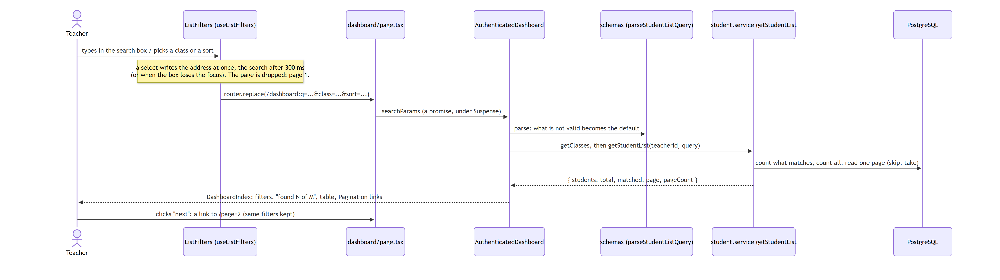](./diagrams/flow-students-list.svg)

Mermaid source

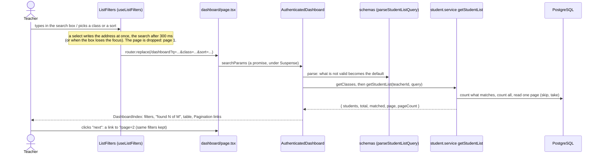
```mermaid
sequenceDiagram
  actor T as Teacher
  participant LF as ListFilters (useListFilters)
  participant PG as dashboard/page.tsx
  participant AD as AuthenticatedDashboard
  participant SC as schemas (parseStudentListQuery)
  participant SV as student.service getStudentList
  participant D as PostgreSQL

  T->>LF: types in the search box / picks a class or a sort
  Note over LF: a select writes the address at once, the search after 300 ms<br>(or when the box loses the focus). The page is dropped: page 1.
  LF->>PG: router.replace(/dashboard?q=...&class=...&sort=...)
  PG->>AD: searchParams (a promise, under Suspense)
  AD->>SC: parse: what is not valid becomes the default
  AD->>SV: getClasses, then getStudentList(teacherId, query)
  SV->>D: count what matches, count all, read one page (skip, take)
  SV-->>AD: { students, total, matched, page, pageCount }
  AD-->>T: DashboardIndex: filters, "found N of M", table, Pagination links
  T->>PG: clicks "next": a link to ?page=2 (same filters kept)
```

### Add and edit a student

[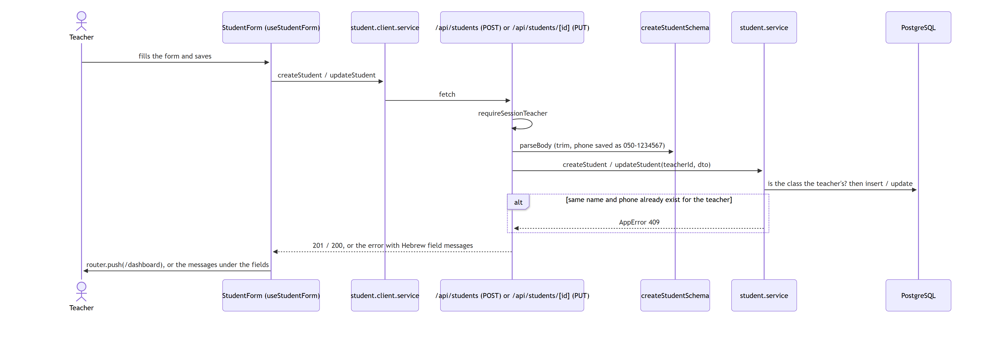](./diagrams/flow-student-form.svg)

Mermaid source

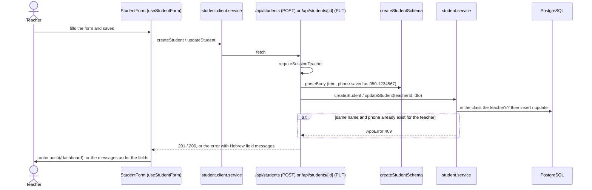
```mermaid
sequenceDiagram
  actor T as Teacher
  participant F as StudentForm (useStudentForm)
  participant C as student.client.service
  participant R as /api/students (POST) or /api/students/[id] (PUT)
  participant V as createStudentSchema
  participant S as student.service
  participant D as PostgreSQL

  T->>F: fills the form and saves
  F->>C: createStudent / updateStudent
  C->>R: fetch
  R->>R: requireSessionTeacher
  R->>V: parseBody (trim, phone saved as 050-1234567)
  R->>S: createStudent / updateStudent(teacherId, dto)
  S->>D: is the class the teacher's? then insert / update
  alt same name and phone already exist for the teacher
    S-->>R: AppError 409
  end
  R-->>F: 201 / 200, or the error with Hebrew field messages
  F->>T: router.push(/dashboard), or the messages under the fields
```

### Create and edit an assignment, with the confirmation

[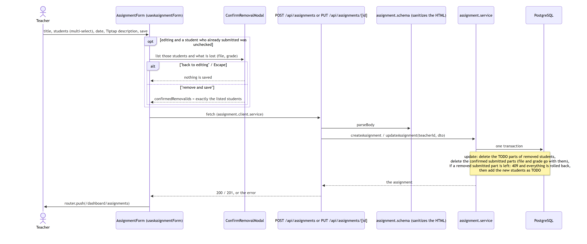](./diagrams/flow-assignment-form.svg)

Mermaid source

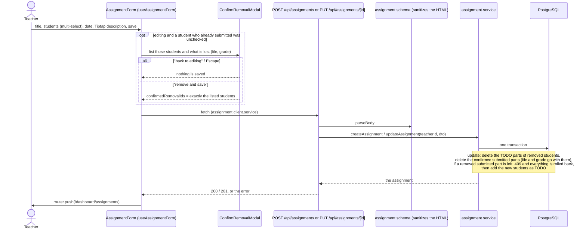
```mermaid
sequenceDiagram
  actor T as Teacher
  participant F as AssignmentForm (useAssignmentForm)
  participant M as ConfirmRemovalModal
  participant R as POST /api/assignments or PUT /api/assignments/[id]
  participant V as assignment.schema (sanitizes the HTML)
  participant S as assignment.service
  participant D as PostgreSQL

  T->>F: title, students (multi-select), date, Tiptap description, save
  opt editing and a student who already submitted was unchecked
    F->>M: list those students and what is lost (file, grade)
    alt "back to editing" / Escape
      M-->>F: nothing is saved
    else "remove and save"
      M-->>F: confirmedRemovalIds = exactly the listed students
    end
  end
  F->>R: fetch (assignment.client.service)
  R->>V: parseBody
  R->>S: createAssignment / updateAssignment(teacherId, dto)
  S->>D: one transaction
  Note over S,D: update: delete the TODO parts of removed students,<br>delete the confirmed submitted parts (file and grade go with them),<br>if a removed submitted part is left: 409 and everything is rolled back,<br>then add the new students as TODO
  S-->>R: the assignment
  R-->>F: 200 / 201, or the error
  F->>T: router.push(/dashboard/assignments)
```

### Upload the checked file and give a grade (the student modal)

[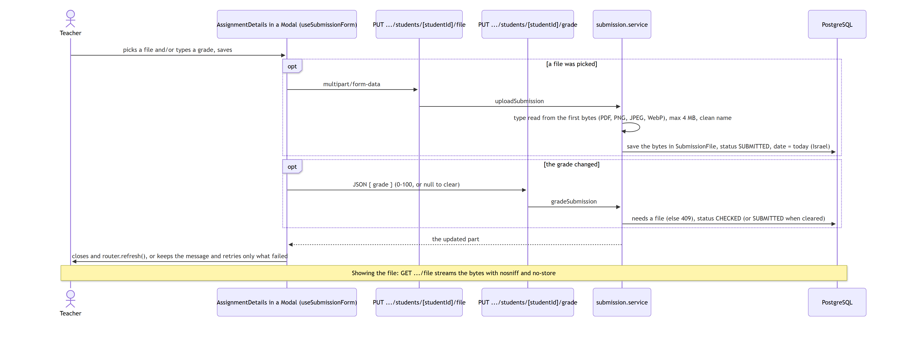](./diagrams/flow-submission.svg)

Mermaid source

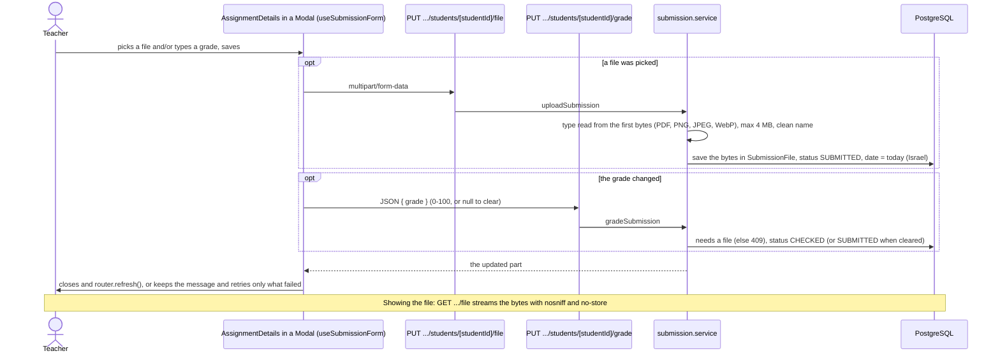
```mermaid
sequenceDiagram
  actor T as Teacher
  participant M as AssignmentDetails in a Modal (useSubmissionForm)
  participant FR as PUT .../students/[studentId]/file
  participant GR as PUT .../students/[studentId]/grade
  participant S as submission.service
  participant D as PostgreSQL

  T->>M: picks a file and/or types a grade, saves
  opt a file was picked
    M->>FR: multipart/form-data
    FR->>S: uploadSubmission
    S->>S: type read from the first bytes (PDF, PNG, JPEG, WebP), max 4 MB, clean name
    S->>D: save the bytes in SubmissionFile, status SUBMITTED, date = today (Israel)
  end
  opt the grade changed
    M->>GR: JSON { grade } (0-100, or null to clear)
    GR->>S: gradeSubmission
    S->>D: needs a file (else 409), status CHECKED (or SUBMITTED when cleared)
  end
  S-->>M: the updated part
  M->>T: closes and router.refresh(), or keeps the message and retries only what failed
  Note over T,D: Showing the file: GET .../file streams the bytes with nosniff and no-store
```

### Delete a student or an assignment

[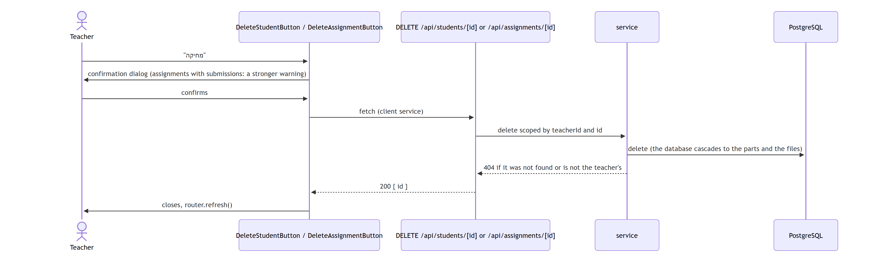](./diagrams/flow-delete.svg)

Mermaid source

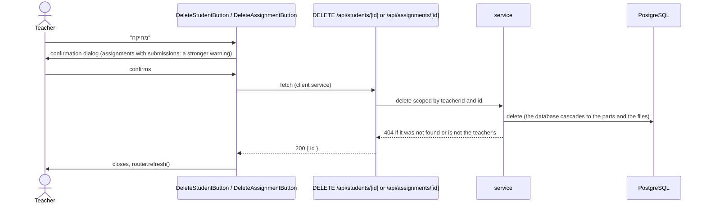
```mermaid
sequenceDiagram
  actor T as Teacher
  participant B as DeleteStudentButton / DeleteAssignmentButton
  participant R as DELETE /api/students/[id] or /api/assignments/[id]
  participant S as service
  participant D as PostgreSQL

  T->>B: "מחיקה"
  B->>T: confirmation dialog (assignments with submissions: a stronger warning)
  T->>B: confirms
  B->>R: fetch (client service)
  R->>S: delete scoped by teacherId and id
  S->>D: delete (the database cascades to the parts and the files)
  S-->>R: 404 if it was not found or is not the teacher's
  R-->>B: 200 { id }
  B->>T: closes, router.refresh()
```

## Where things live

| Folder | What is in it |
|---|---|
| `app/` | Pages and route handlers only. `(root)/dashboard` has the students list, `students/[id]`, `assignments/...`. `api/` has the endpoints. `not-found.tsx`, `error.tsx`, `global-error.tsx` are the app-level pages |
| `components/` | Grouped by feature (`auth`, `dashboard`, `students`, `assignments`) and `ui` (shared: Modal, Button, FormField, ListFilters, Pagination, RichTextEditor, ...) |
| `hooks/` | The state and logic of a client component (`useAssignmentForm`, `useListFilters`, ...) |
| `services/` | `*.service.ts`: server, talk to the database. `*.client.service.ts`, `api.client.service.ts`, `ApiError.client.ts`: the browser's calls to the API |
| `schemas/` | zod schemas: the rules of every input, and the parsing of the list addresses |
| `lib/` | Prisma client, `AppError`, route helpers (`apiRoute.ts`), the login limiter, HTML cleaner, file helpers, pagination and search helpers |
| `helpers/`, `constants/`, `types/` | Small pure helpers, shared constants (also the Hebrew error messages), shared types |
| `prisma/` | Schema, migrations, seed |
| `proxy.ts` | The session check in front of everything |
| `tests/` | Playwright e2e (API and UI). Unit tests (Vitest) sit next to the code as `*.test.ts` |
